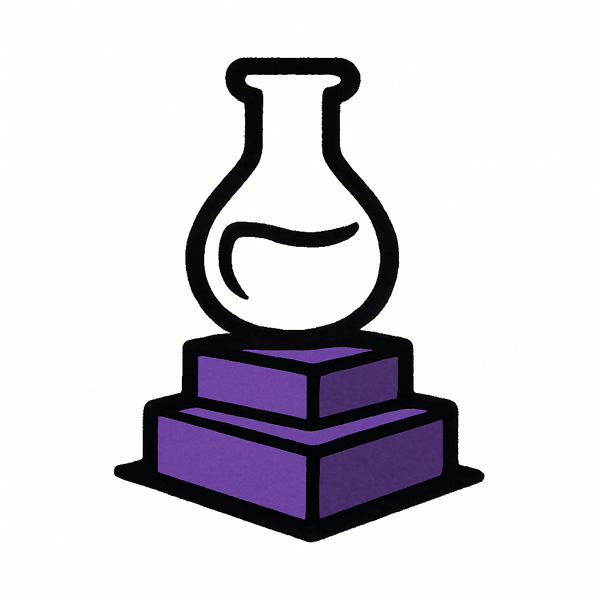

<div align="center">  
    <picture>
      
    </picture>
    <h1> OBSIFLASK </h1>
    <p align="center"> Simple web service for Obsidian vaults </p>
</div>


**OBSIFLASK** is a lightweight web service for Obsidian vaults, built on Flask.  
It supports multiple vaults, search and navigation, background tasks, and graph visualization.

---

## 🚀 Features
- 🌐 **Web UI** — clean and convenient interface for note browsing  
- 📚 **Multi-vault support** — work with multiple vaults at once  
- 🔎 **Advanced search** — exact search, regex, fuzzy search, tag search, link search, and filter-based search  
- 📝 **Task scheduler** — run periodic shell tasks per vault with logs and messages  
- ⚡ **Graph visualization** — global graph rendering, filtering, tag coloring, clustering  

---

## 📦 Getting Started
For OBSIFLASK configuration, please see [Config file](https://github.com/bahleg/OBSIFLASK/blob/main/src/obsiflask/config.py).

With an example config, the server will be started at https://localhost:8000. 

### Python
```bash
git clone https://github.com/bahleg/obsiflask.git
cd src
pip install .
obsiflask ../example/config.yml
```


### Docker
Demo run:
```bash bash build_docker.sh
docker run -p 8000:8000 obsiflask
```

## 🤝 Contributing

This is a personal pet project that I develop in my free time.  
Expect plenty of bugs, missing features, and rough edges 🙂  

That said — feedback, issues, and pull requests are very welcome!  
If you have ideas, suggestions, or fixes, feel free to open an issue or submit a PR.


## More
* [License: GPLv3](LICENSE)
* [Changelog](changelog.md)
* [Roadmap](roadmap.md)

