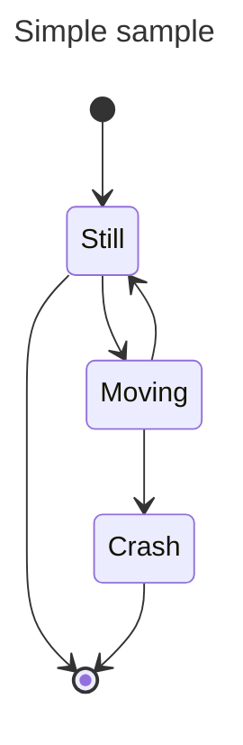

# ✏️ Markdown editor

The Markdown editor consists of two panes:
- a plain text area for editing, and
- a preview pane.

⚠️ The preview is refreshed only after saving the document.
On small screens (e.g. mobile devices), the preview is hidden.
You can switch between the editor and the rendered view using the button in the top-right corner.

You can also disable this preview in the [config](https://github.com/bahleg/OBSIFLASK/blob/main/obsiflask/config.py).


### Edit modes
Currenly, OBSIFLASK allows to use two editor modes:
* A vanilla HTML text editor
* An editor based on [easyMDE](https://github.com/Ionaru/easy-markdown-editor).

You can select one of the modes in the [config](https://github.com/bahleg/OBSIFLASK/blob/main/obsiflask/config.py).

### Autocompletion
OBSIFLASK supports autocompletion: depending on the context, it suggests
links, tags, or the current date as hints.

To trigger autocompletion, press <Tab> on a non-empty string or click the "abc" button.


## ⚠️ Attention 

Currently, files are automatically saved every 5 seconds.  
Keep in mind that you should save your work manually before leaving the browser.


# 👁️ Markdown rendering

The editor supports basic Markdown features, including:
* bullets
* [ ] todo lists
* ### headers
* [links](https://github.com/bahleg/OBSIFLASK) and [[Files, directories and links | wikilins (see details here)]]
* vanilla http links: https://github.com
* ~~different~~ *text* **styles**
* Hashtags: #odd and #even
* Frontmatter properties: are represented as a separate block of the page, see [[frontmatter example]].
*  ==marked== text 
* Math formulae: $x^2 = y$. 
* Outline formulae: 
	
$$
x^2 = y.
$$
	
* basic markdown tables:
	
| Month    | Savings |
| -------- | ------- |
| January  | $250    |
| February | $80     |
| March    | $420    |
	
* Code blocks 
```
	echo "hello world"
```
	
## Mermaid support

Mermaid is supported :) 

## 🖇️ File Embedding and attachements

Depending on the file type, attachments are handled differently.
### 🖼️ Images

Both global (external) and local (vault) links are supported.

Embedding an image from Wikipedia (external):

![[https://upload.wikimedia.org/wikipedia/commons/thumb/6/68/Orange_tabby_cat_sitting_on_fallen_leaves-Hisashi-01A.jpg/800px-Orange_tabby_cat_sitting_on_fallen_leaves-Hisashi-01A.jpg]]

Embedding an image from the vault:

![[logo.png]]

### 🗄️ Bases

Bases can be embedded in the same way as in Obsidian (see [[Bases support]] for details).

Example of embedding a digit base:

![[base.base]]

### 📄 Other files

Non-image and non-base files are rendered as download links. Example:
![[non-md-file.txt]]


# ✒️ Excalidraw

[Excalidraw](https://excalidraw.com/) is a tool for creating drawings and canvas-style diagrams.
OBSIFLASK can open `.excalidraw` files directly.  
Example: [[excalidrawexample.excalidraw]]

It's also compatible to the [Obsidian plugin for excalidraw](https://github.com/zsviczian/obsidian-excalidraw-plugin), supporting save/open operations for both [[excalidraw_plugin_example.excalidraw.md| uncompressed]] and [[excalidraw_plugin_example_compressed.excalidraw.md| compressed]] files. These files must have an `.excalidraw.md` file extension.
