# 📸 Gallery
## Vault menu
| Obsidian | OBSIFLASK |
|---------|-----------|
|  | 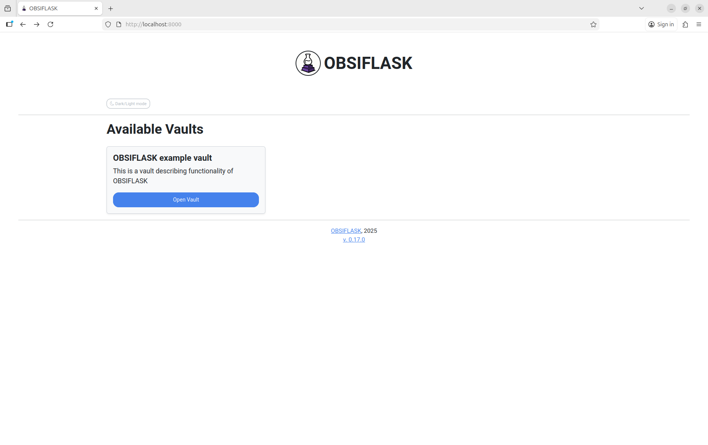 |

## Editor/viewer view
| Obsidian | OBSIFLASK |
|---------|-----------|
| 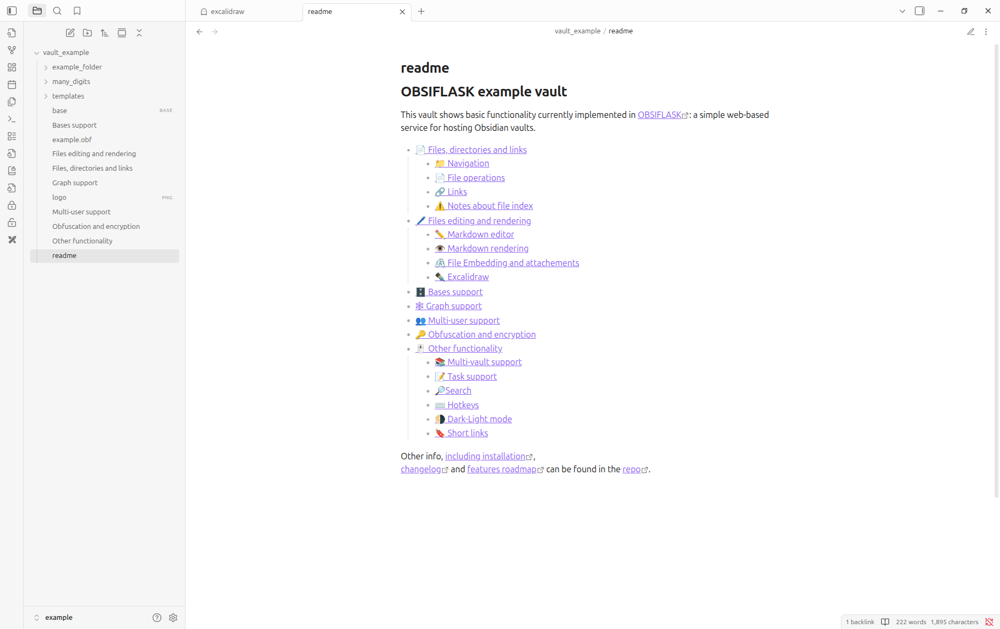 | 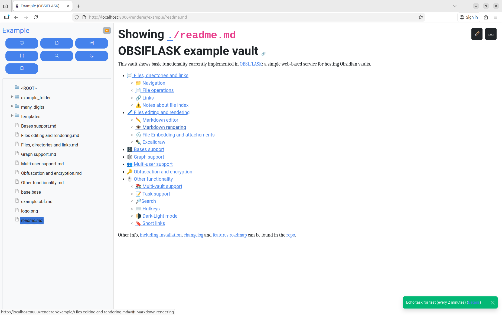 |

## Markdown rendering
| Obsidian | OBSIFLASK |
|---------|-----------|
| 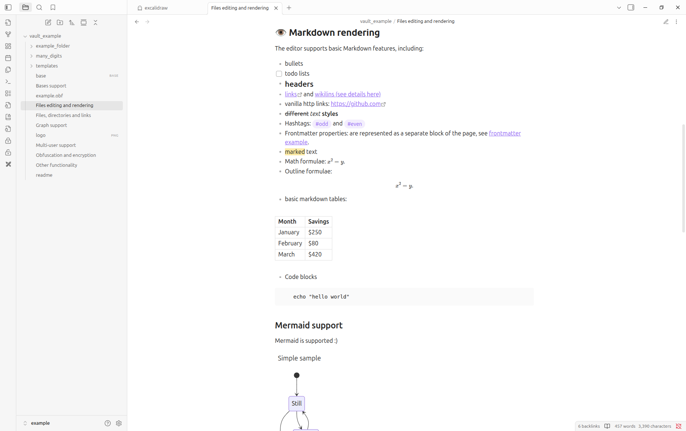 |  |

## Bases support
| Obsidian | OBSIFLASK |
|---------|-----------|
| 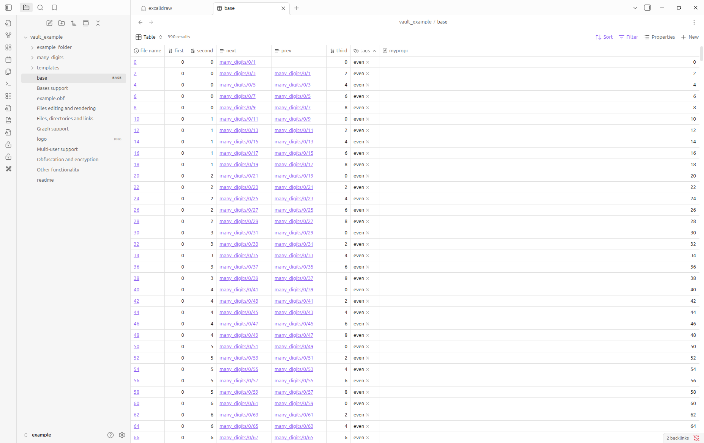 | 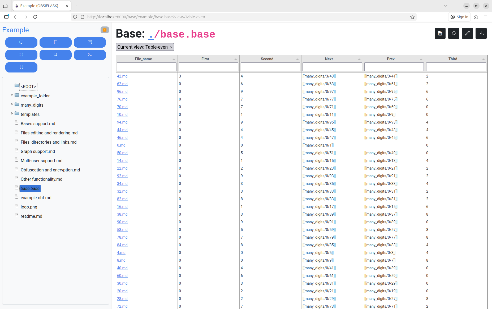 |

## Excalidraw support
| Obsidian | OBSIFLASK |
|---------|-----------|
| 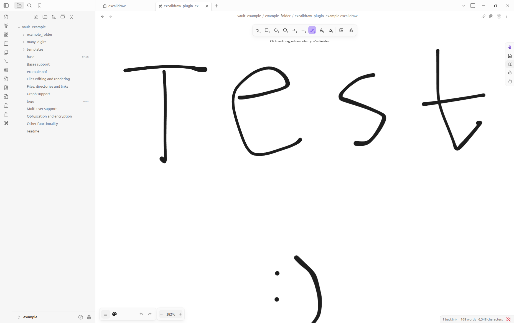 | 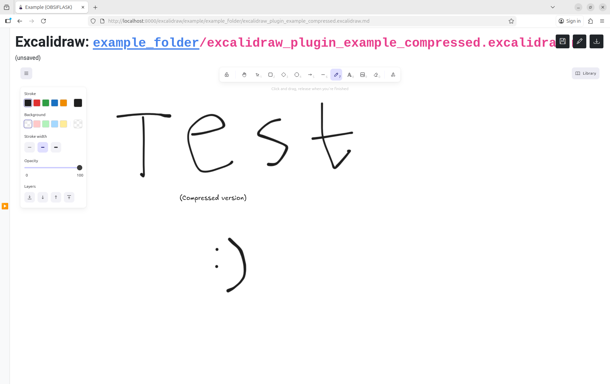 |

## Graph support
| Obsidian | OBSIFLASK |
|---------|-----------|
| 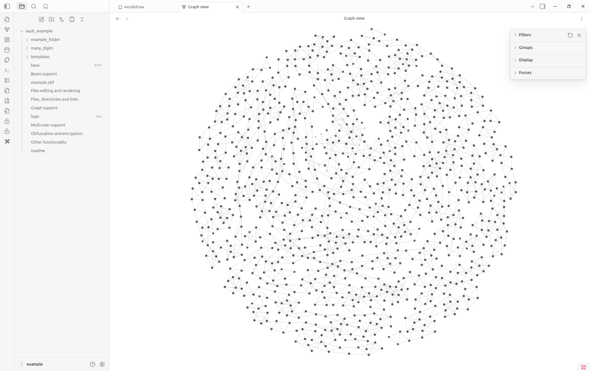 | 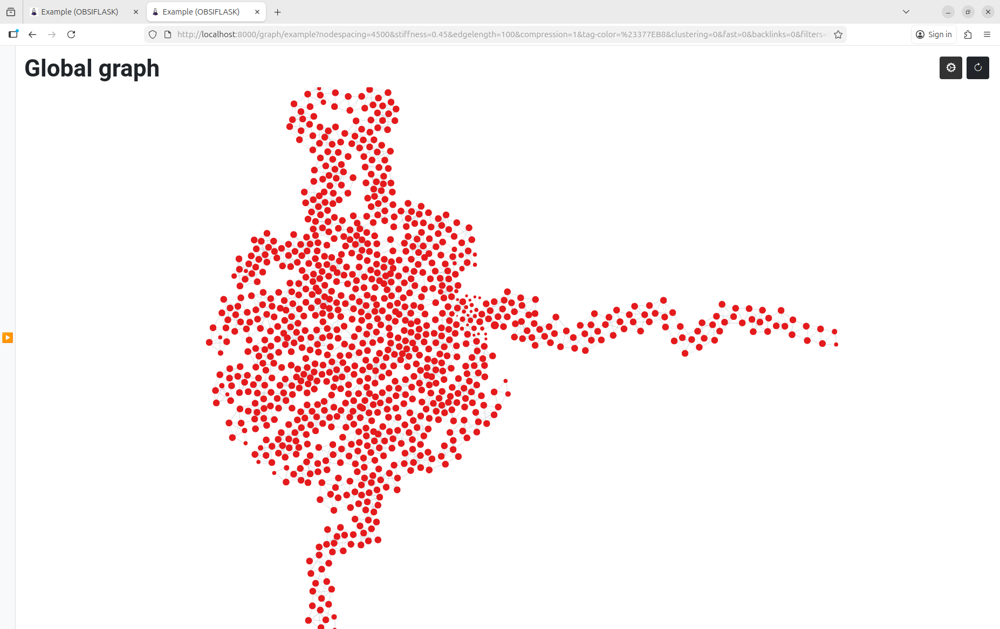 |

## Encryptiong support
| Obsidian | OBSIFLASK |
|---------|-----------|
| 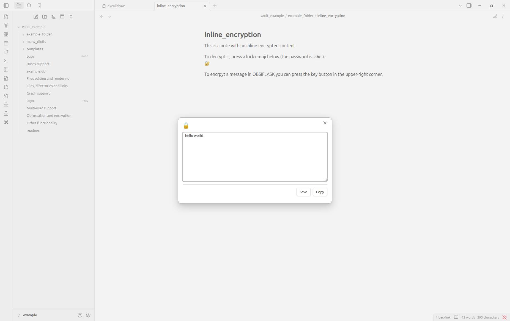 | 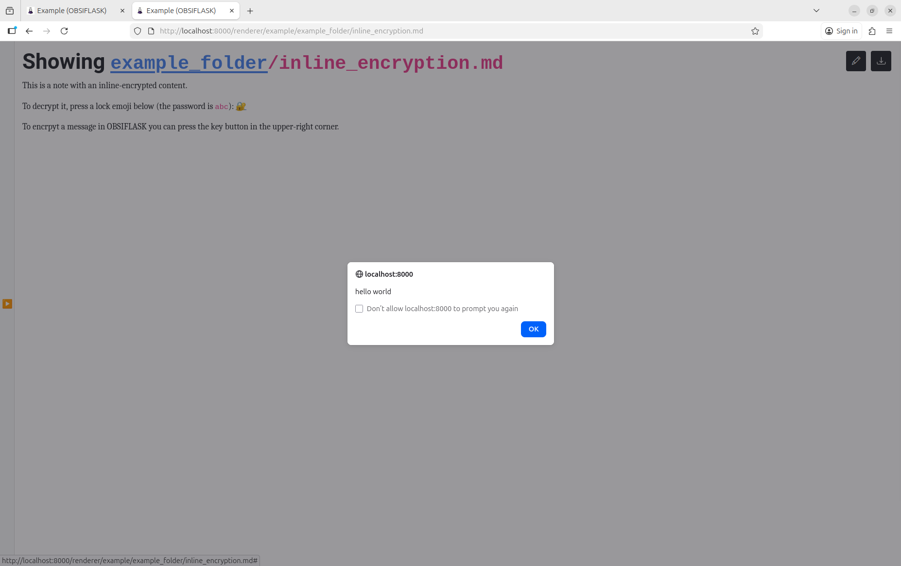 |

### Other functionality implemented only in OBSIFLASK
| Advanced graphs with clustering | Multi-user support and user-specific settings |
|---------|-----------|
| 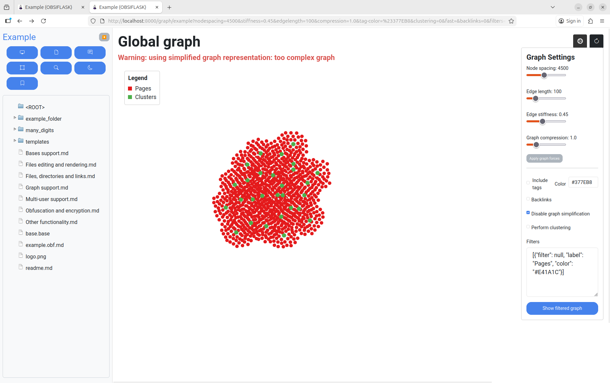 | 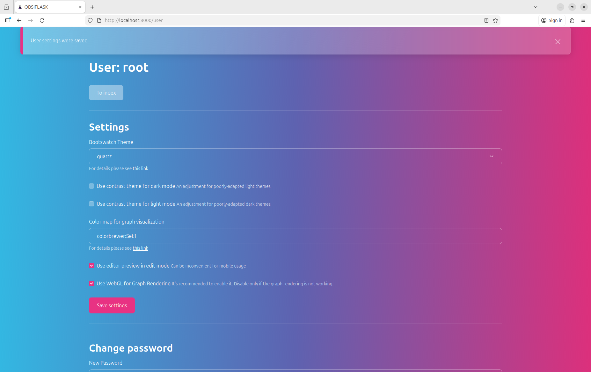 |
